Activity 5 - Mini-competition Explorations (Group-C)
================

## Reading in the Datafile

``` r
## Reading in data for producing graphs

# stdnt <- read.csv("./data/allendale-students.csv")
stdnt <- read_csv(here::here("competition-files","data","allendale-students.csv"))

head(stdnt)
```

    ## # A tibble: 6 × 7
    ##   distance scholarship parents   car housing    major     debt
    ##      <dbl>       <dbl>   <dbl> <dbl> <chr>      <chr>    <dbl>
    ## 1       40        1532   0.44      6 off campus STEM     26389
    ## 2       30        7479   0.265     7 on campus  STEM     21268
    ## 3      130        2664   0.115     3 on campus  business 32312
    ## 4      120        1998   0.325     9 on campus  business 28539
    ## 5       30        1462   0.105    10 off campus other    34867
    ## 6        0        3053   0.335     9 off campus STEM     18193

``` r
dim(stdnt)
```

    ## [1] 200   7

``` r
stdnt$housing <- as.factor(stdnt$housing)
stdnt$major <- as.factor(stdnt$major)
```

``` r
skimr::skim(stdnt)
```

|                                                  |       |
|:-------------------------------------------------|:------|
| Name                                             | stdnt |
| Number of rows                                   | 200   |
| Number of columns                                | 7     |
| \_\_\_\_\_\_\_\_\_\_\_\_\_\_\_\_\_\_\_\_\_\_\_   |       |
| Column type frequency:                           |       |
| factor                                           | 2     |
| numeric                                          | 5     |
| \_\_\_\_\_\_\_\_\_\_\_\_\_\_\_\_\_\_\_\_\_\_\_\_ |       |
| Group variables                                  | None  |

Data summary

**Variable type: factor**

| skim\_variable | n\_missing | complete\_rate | ordered | n\_unique | top\_counts                |
|:---------------|-----------:|---------------:|:--------|----------:|:---------------------------|
| housing        |          0 |              1 | FALSE   |         2 | off: 120, on : 80          |
| major          |          0 |              1 | FALSE   |         3 | STE: 100, bus: 64, oth: 36 |

**Variable type: numeric**

| skim\_variable | n\_missing | complete\_rate |     mean |      sd |   p0 |      p25 |      p50 |      p75 |    p100 | hist  |
|:---------------|-----------:|---------------:|---------:|--------:|-----:|---------:|---------:|---------:|--------:|:------|
| distance       |          0 |              1 |    96.55 |   89.45 |    0 |    30.00 |    70.00 |   140.00 |   530.0 | ▇▃▁▁▁ |
| scholarship    |          0 |              1 |  3899.07 | 3396.34 |   25 |  1312.25 |  3202.50 |  5503.50 | 26574.0 | ▇▂▁▁▁ |
| parents        |          0 |              1 |     0.27 |    0.14 |    0 |     0.16 |     0.28 |     0.38 |     0.5 | ▅▆▇▇▇ |
| car            |          0 |              1 |     7.08 |    2.03 |    1 |     6.00 |     7.00 |     9.00 |    12.0 | ▁▅▇▇▂ |
| debt           |          0 |              1 | 29472.72 | 8484.97 | 2019 | 24231.25 | 29827.00 | 35022.00 | 49196.0 | ▁▂▇▇▂ |

``` r
summary(stdnt)
```

    ##     distance       scholarship       parents            car       
    ##  Min.   :  0.00   Min.   :   25   Min.   :0.0000   Min.   : 1.00  
    ##  1st Qu.: 30.00   1st Qu.: 1312   1st Qu.:0.1588   1st Qu.: 6.00  
    ##  Median : 70.00   Median : 3202   Median :0.2800   Median : 7.00  
    ##  Mean   : 96.55   Mean   : 3899   Mean   :0.2666   Mean   : 7.08  
    ##  3rd Qu.:140.00   3rd Qu.: 5504   3rd Qu.:0.3812   3rd Qu.: 9.00  
    ##  Max.   :530.00   Max.   :26574   Max.   :0.4950   Max.   :12.00  
    ##        housing         major          debt      
    ##  off campus:120   business: 64   Min.   : 2019  
    ##  on campus : 80   other   : 36   1st Qu.:24231  
    ##                   STEM    :100   Median :29827  
    ##                                  Mean   :29473  
    ##                                  3rd Qu.:35022  
    ##                                  Max.   :49196

## Identifying the outliers

``` r
boxplot(stdnt$distance, col = "orange", horizontal = TRUE )
```

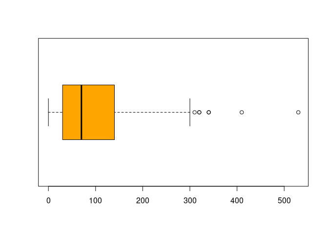<!-- -->

``` r
boxplot(stdnt$scholarship, col = "orange", horizontal = TRUE )
```

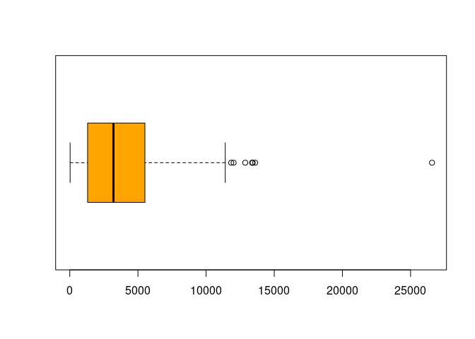<!-- -->

``` r
boxplot(stdnt$parents, col = "orange", horizontal = TRUE )
```

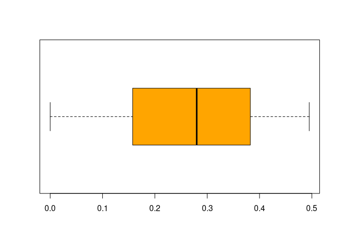<!-- -->

``` r
boxplot(stdnt$car, col = "orange", horizontal = TRUE )
```

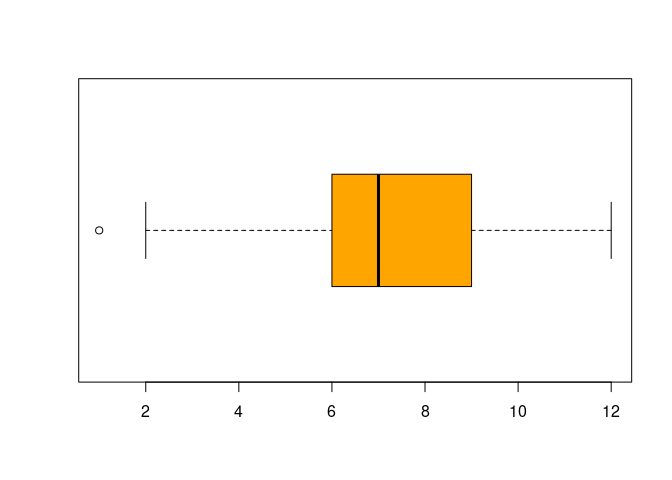<!-- -->

``` r
boxplot(stdnt$debt, col = "orange", horizontal = TRUE )
```

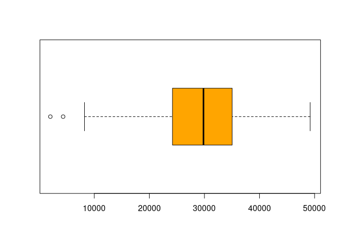<!-- -->
\#\# Normalizing the data

### Dealing with outliers

``` r
normdata <- stdnt %>% 
  filter(distance < 250) %>% 
  filter(scholarship < 11000) %>% 
  filter(car > 2) %>% 
  filter(debt > 10000)
boxplot(normdata$distance, col = "orange", horizontal = TRUE, main = "Boxplot of distance")
```

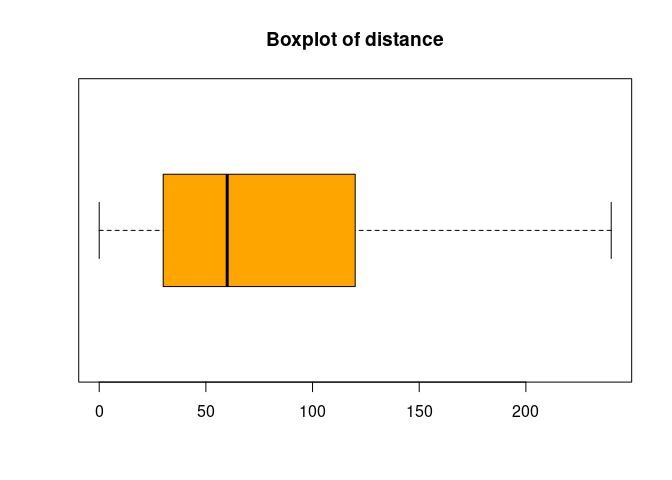<!-- -->

``` r
boxplot(normdata$scholarship, col = "orange", horizontal = TRUE, main = "Boxplot of scholarship" )
```

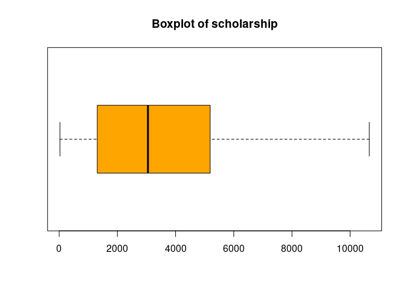<!-- -->

``` r
boxplot(stdnt$parents, col = "orange", horizontal = TRUE, main = "Boxplot of parents")
```

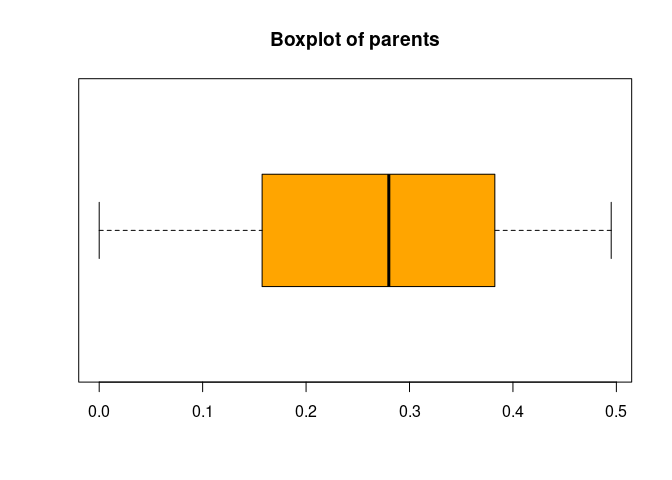<!-- -->

``` r
boxplot(normdata$car, col = "orange", horizontal = TRUE, main = "Boxplot of car" )
```

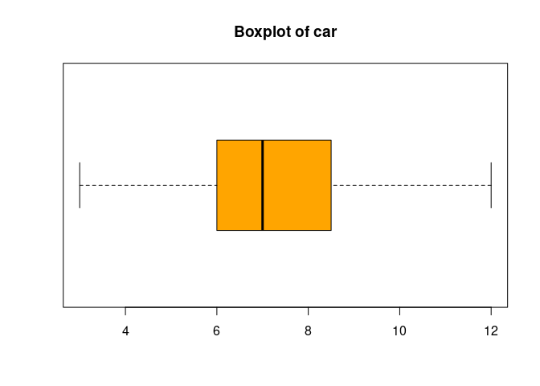<!-- -->

``` r
boxplot(normdata$debt, col = "orange", horizontal = TRUE, main = "Boxplot of debt")
```

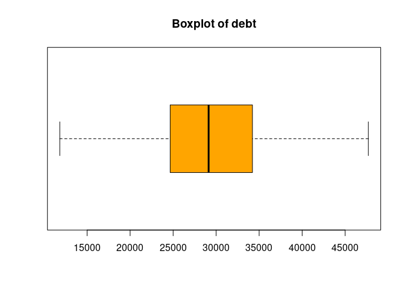<!-- -->

``` r
hist(normdata$distance)
```

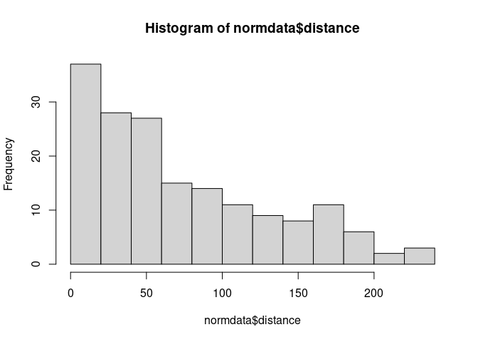<!-- -->

``` r
hist(normdata$scholarship)
```

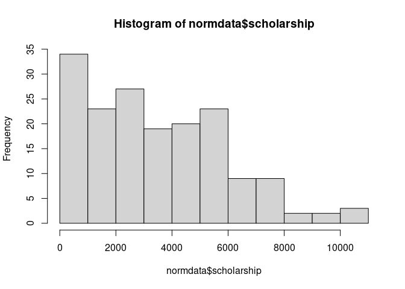<!-- -->

``` r
hist(normdata$parents)
```

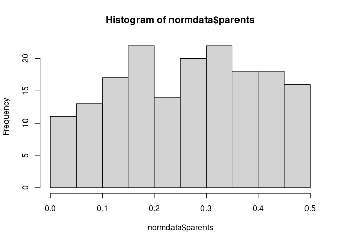<!-- -->

``` r
hist(normdata$car)
```

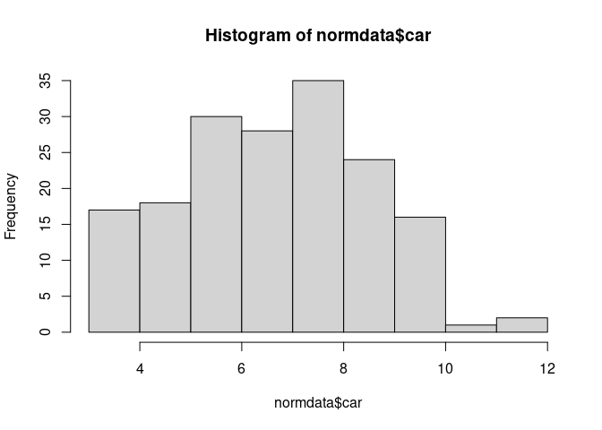<!-- -->

``` r
hist(normdata$debt)
```

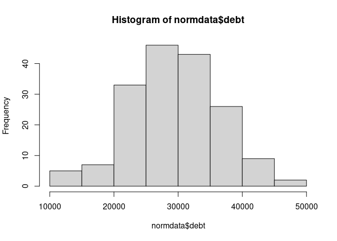<!-- -->

``` r
boxplot(debt~housing, data = normdata, main = "Boxplot of debt by housing type", xlab = "Housing type", ylab = "Debt", col=topo.colors(7))
```

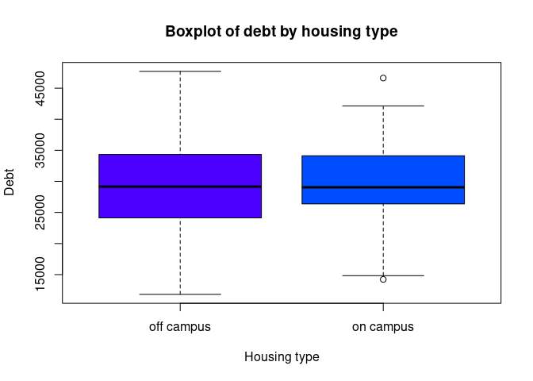<!-- -->

``` r
boxplot(debt~major, data = normdata, main = "Boxplot of debt by major type", xlab = "Major type", ylab = "Debt", col=topo.colors(7))
```

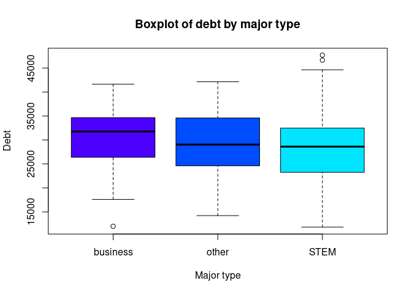<!-- -->

``` r
ggplot(normdata, aes(x = factor(car), y = debt, fill = major, colour = major)) + 
  geom_bar(stat = "identity", position = "dodge") +
    labs(x="Age of car (in years)", y="Student debt (in dollars)") +
      theme_bw() + 
        theme(panel.grid.major = element_blank(), panel.grid.minor = element_blank()) +
          theme(legend.position = c(0.1, 0.85))
```

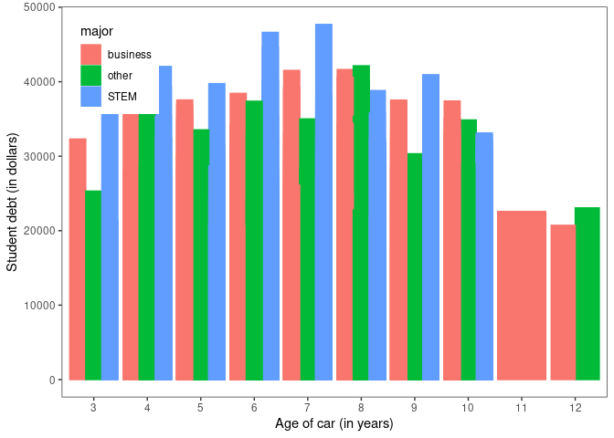<!-- -->

``` r
ggplot(normdata, aes(x = factor(car), y = scholarship, fill = major, colour = major)) + 
  geom_bar(stat = "identity", position = "dodge") +
    labs(x="Age of car (in years)", y="Scholarship (in dollars)") +
      theme_bw() + 
        theme(panel.grid.major = element_blank(), panel.grid.minor = element_blank()) +
          theme(legend.position = c(0.1, 0.85))
```

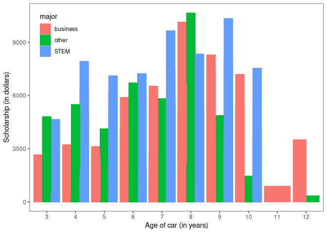<!-- -->

``` r
normdata <- normdata %>% mutate(sqrt_distance = sqrt(distance), sqrt_scholarship = sqrt(scholarship))
```

``` r
hist(normdata$sqrt_distance)
```

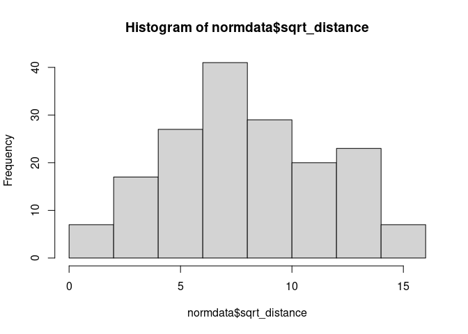<!-- -->

``` r
hist(normdata$sqrt_scholarship)
```

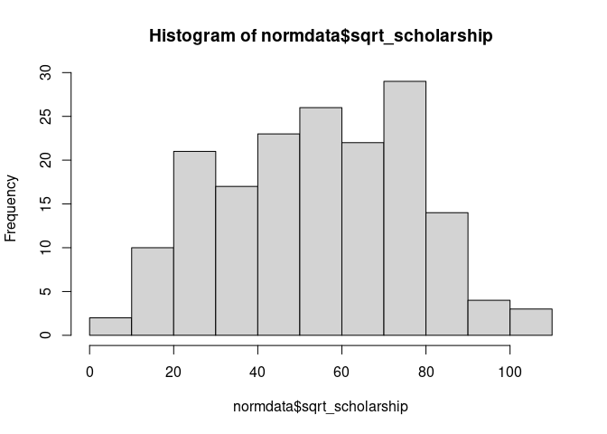<!-- -->

``` r
normdata <- normdata %>% select(debt,distance, scholarship, parents, car, housing, major, sqrt_distance, sqrt_scholarship)
```

``` r
normdata %>% select(debt,distance, scholarship, parents, car) %>% ggpairs
```

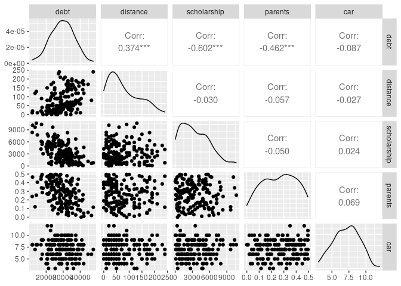<!-- -->

``` r
normdata %>% select(debt,sqrt_distance, sqrt_scholarship, parents, car) %>% ggpairs
```

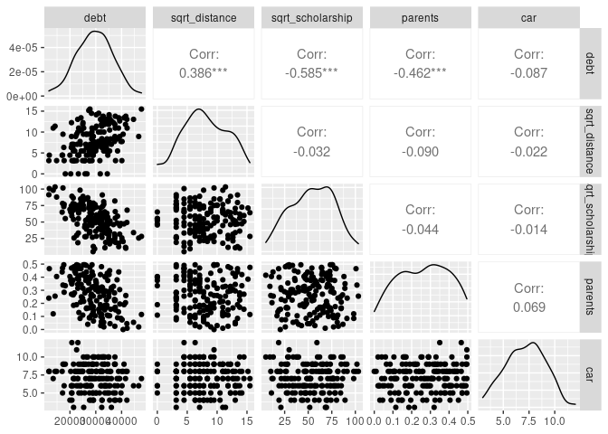<!-- -->

``` r
corr_matrix <- cor(normdata[,c("sqrt_distance", "sqrt_scholarship", "parents", "car", "debt")], use = "everything")
round(corr_matrix, 3)
```

    ##                  sqrt_distance sqrt_scholarship parents    car   debt
    ## sqrt_distance            1.000           -0.032  -0.090 -0.022  0.386
    ## sqrt_scholarship        -0.032            1.000  -0.044 -0.014 -0.585
    ## parents                 -0.090           -0.044   1.000  0.069 -0.462
    ## car                     -0.022           -0.014   0.069  1.000 -0.087
    ## debt                     0.386           -0.585  -0.462 -0.087  1.000

``` r
corrplot.mixed(corr_matrix, lower.col = "black", number.cex = .7, upper = "ellipse")
```

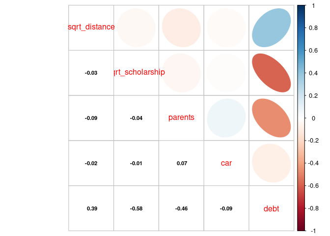<!-- -->

It seems like sqrt\_distance has the strongest linear relationship with
debt.

``` r
model.1 <- lm(debt~sqrt_distance, data=normdata)
summary(model.1)
```

    ## 
    ## Call:
    ## lm(formula = debt ~ sqrt_distance, data = normdata)
    ## 
    ## Residuals:
    ##      Min       1Q   Median       3Q      Max 
    ## -18102.9  -4238.9    135.1   4240.5  16482.7 
    ## 
    ## Coefficients:
    ##               Estimate Std. Error t value Pr(>|t|)    
    ## (Intercept)    23672.9     1172.0  20.199  < 2e-16 ***
    ## sqrt_distance    724.1      133.1   5.441 1.84e-07 ***
    ## ---
    ## Signif. codes:  0 '***' 0.001 '**' 0.01 '*' 0.05 '.' 0.1 ' ' 1
    ## 
    ## Residual standard error: 6410 on 169 degrees of freedom
    ## Multiple R-squared:  0.149,  Adjusted R-squared:  0.144 
    ## F-statistic:  29.6 on 1 and 169 DF,  p-value: 1.838e-07

Only 14.9% of the variability in debt that is accounted for this model.

``` r
model.2 <- lm(debt~sqrt_distance+sqrt_scholarship+parents+car+housing+major, data=normdata)
summary(model.2)
```

    ## 
    ## Call:
    ## lm(formula = debt ~ sqrt_distance + sqrt_scholarship + parents + 
    ##     car + housing + major, data = normdata)
    ## 
    ## Residuals:
    ##      Min       1Q   Median       3Q      Max 
    ## -12489.9  -2625.6    160.2   2539.3  10281.3 
    ## 
    ## Coefficients:
    ##                   Estimate Std. Error t value Pr(>|t|)    
    ## (Intercept)       42902.44    1766.40  24.288  < 2e-16 ***
    ## sqrt_distance       599.20      80.54   7.440 5.46e-12 ***
    ## sqrt_scholarship   -179.71      13.16 -13.654  < 2e-16 ***
    ## parents          -23837.90    2194.21 -10.864  < 2e-16 ***
    ## car                -217.61     156.92  -1.387   0.1674    
    ## housingon campus   1011.62     613.16   1.650   0.1009    
    ## majorother        -1679.30     861.79  -1.949   0.0531 .  
    ## majorSTEM         -1430.11     673.09  -2.125   0.0351 *  
    ## ---
    ## Signif. codes:  0 '***' 0.001 '**' 0.01 '*' 0.05 '.' 0.1 ' ' 1
    ## 
    ## Residual standard error: 3850 on 163 degrees of freedom
    ## Multiple R-squared:  0.704,  Adjusted R-squared:  0.6913 
    ## F-statistic: 55.37 on 7 and 163 DF,  p-value: < 2.2e-16

In this model, 69.1% of the variability in debt is accounted. and, we
noticed that car has the largest p-value and thus least significant. We
could remove it from the model and return the analysis.

``` r
model.3 <- lm(debt~sqrt_distance+sqrt_scholarship+parents+housing+major, data=normdata)
summary(model.3)
```

    ## 
    ## Call:
    ## lm(formula = debt ~ sqrt_distance + sqrt_scholarship + parents + 
    ##     housing + major, data = normdata)
    ## 
    ## Residuals:
    ##      Min       1Q   Median       3Q      Max 
    ## -12504.8  -2787.5    236.4   2599.6  10007.3 
    ## 
    ## Coefficients:
    ##                   Estimate Std. Error t value Pr(>|t|)    
    ## (Intercept)       41269.42    1320.33  31.257  < 2e-16 ***
    ## sqrt_distance       601.82      80.74   7.454 4.95e-12 ***
    ## sqrt_scholarship   -179.60      13.20 -13.608  < 2e-16 ***
    ## parents          -24023.58    2196.28 -10.938  < 2e-16 ***
    ## housingon campus   1101.59     611.44   1.802   0.0734 .  
    ## majorother        -1592.14     861.91  -1.847   0.0665 .  
    ## majorSTEM         -1322.94     670.52  -1.973   0.0502 .  
    ## ---
    ## Signif. codes:  0 '***' 0.001 '**' 0.01 '*' 0.05 '.' 0.1 ' ' 1
    ## 
    ## Residual standard error: 3861 on 164 degrees of freedom
    ## Multiple R-squared:  0.7005, Adjusted R-squared:  0.6895 
    ## F-statistic: 63.92 on 6 and 164 DF,  p-value: < 2.2e-16

Similarly, we could remove housing from the model and return analysis.

``` r
model.4 <- lm(debt~sqrt_distance+sqrt_scholarship+parents+major, data=normdata)
summary(model.4)
```

    ## 
    ## Call:
    ## lm(formula = debt ~ sqrt_distance + sqrt_scholarship + parents + 
    ##     major, data = normdata)
    ## 
    ## Residuals:
    ##      Min       1Q   Median       3Q      Max 
    ## -12871.2  -2838.3    -28.8   2776.9  10614.1 
    ## 
    ## Coefficients:
    ##                   Estimate Std. Error t value Pr(>|t|)    
    ## (Intercept)       41652.12    1311.97  31.748   <2e-16 ***
    ## sqrt_distance       602.84      81.29   7.416    6e-12 ***
    ## sqrt_scholarship   -180.63      13.28 -13.606   <2e-16 ***
    ## parents          -23744.76    2205.68 -10.765   <2e-16 ***
    ## majorother        -1644.82     867.26  -1.897   0.0596 .  
    ## majorSTEM         -1283.19     674.70  -1.902   0.0589 .  
    ## ---
    ## Signif. codes:  0 '***' 0.001 '**' 0.01 '*' 0.05 '.' 0.1 ' ' 1
    ## 
    ## Residual standard error: 3887 on 165 degrees of freedom
    ## Multiple R-squared:  0.6945, Adjusted R-squared:  0.6853 
    ## F-statistic: 75.04 on 5 and 165 DF,  p-value: < 2.2e-16

Now, let’s remove major from the model.

``` r
model.5 <- lm(debt~sqrt_distance+sqrt_scholarship+parents, data=normdata)
summary(model.5)
```

    ## 
    ## Call:
    ## lm(formula = debt ~ sqrt_distance + sqrt_scholarship + parents, 
    ##     data = normdata)
    ## 
    ## Residuals:
    ##      Min       1Q   Median       3Q      Max 
    ## -13105.5  -2676.0    274.5   2602.2  10466.2 
    ## 
    ## Coefficients:
    ##                   Estimate Std. Error t value Pr(>|t|)    
    ## (Intercept)       40640.38    1236.92  32.856  < 2e-16 ***
    ## sqrt_distance       611.12      81.80   7.471 4.22e-12 ***
    ## sqrt_scholarship   -182.56      13.35 -13.678  < 2e-16 ***
    ## parents          -23228.80    2211.10 -10.506  < 2e-16 ***
    ## ---
    ## Signif. codes:  0 '***' 0.001 '**' 0.01 '*' 0.05 '.' 0.1 ' ' 1
    ## 
    ## Residual standard error: 3921 on 167 degrees of freedom
    ## Multiple R-squared:  0.6854, Adjusted R-squared:  0.6797 
    ## F-statistic: 121.3 on 3 and 167 DF,  p-value: < 2.2e-16

Finally, 67.97% of the variability in student debt is accounted for in
this multiple linear regression model.

``` r
ols_vif_tol(model.5)
```

    ##          Variables Tolerance      VIF
    ## 1    sqrt_distance 0.9905632 1.009527
    ## 2 sqrt_scholarship 0.9968247 1.003185
    ## 3          parents 0.9896704 1.010437

The VIF score represents that multicollinearity does not exist in this
model. Also, These score indicates that the variables are moderately
correlated.

## Residual Analysis

``` r
bptest(debt~sqrt_distance+sqrt_scholarship+parents, varformula = ~ fitted.values(model.5), studentize=TRUE, data=normdata)
```

    ## 
    ##  studentized Breusch-Pagan test
    ## 
    ## data:  debt ~ sqrt_distance + sqrt_scholarship + parents
    ## BP = 0.047803, df = 1, p-value = 0.8269

``` r
plot(model.5)
```

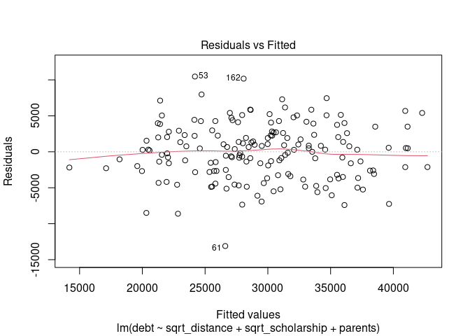<!-- -->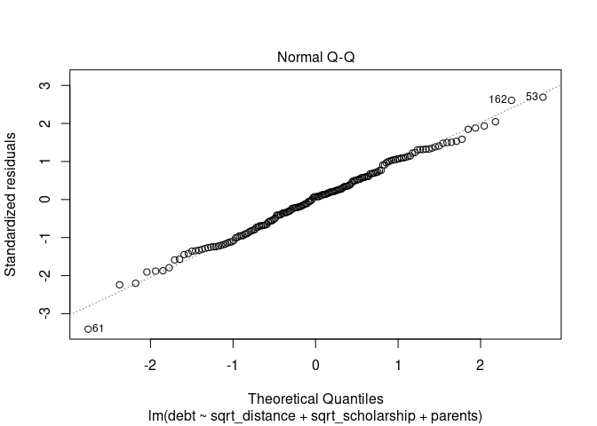<!-- -->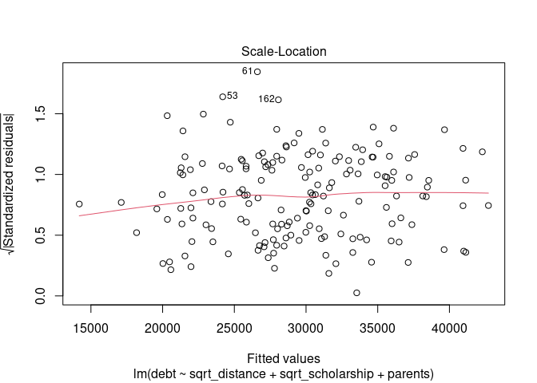<!-- -->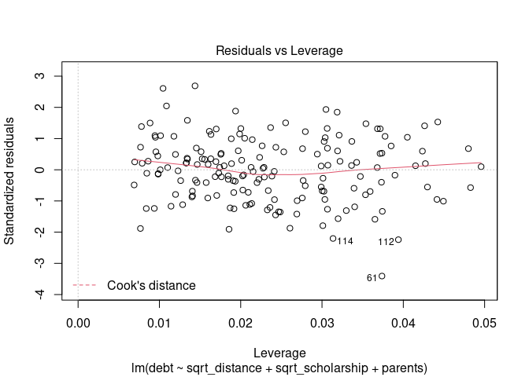<!-- -->

The insignificant p-value indicates that residuals have constant
variance.
